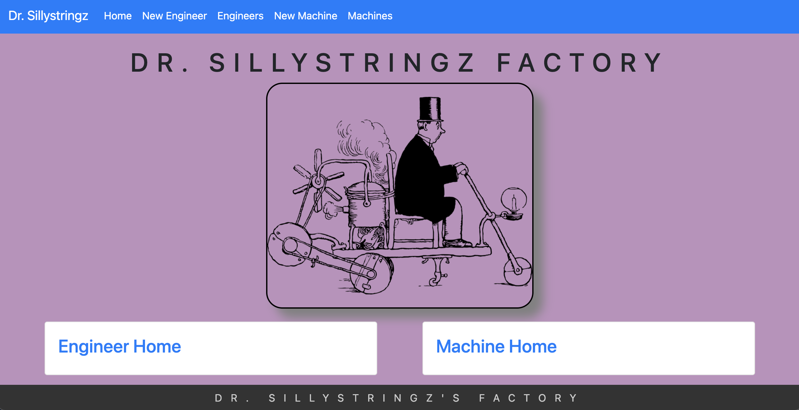
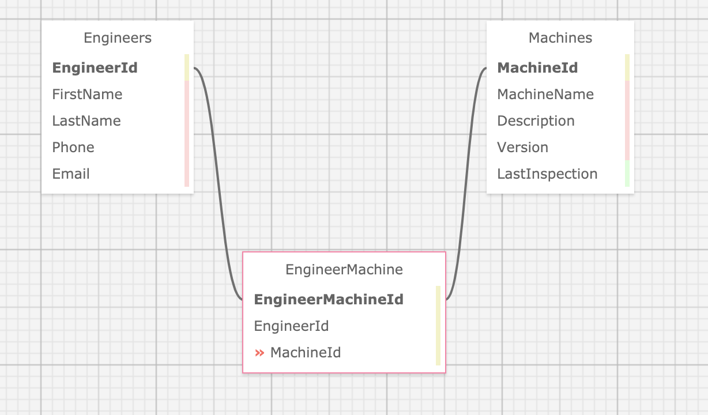

<div align="center">

  # Dr. Sillystringz Factory

  #### Independent Project for Epicodus Coding School on ASP.NET Core MVC, Entity Framework, & Many-to-Many Relationships

  #### Project Began on 1.8.2021. Last updated 1.10.2021.

</div>

#### Preview


---

## Description

This MVC web application is to keep track of a factory's machine repairs by managing their engineers and the machines they are licensed to fix. Engineers & machines can both be added to their prospective lists, and specifications can be added to designate which engineers are licensed to repair which machines. Engineers & Machines have a many-to-many relationship, where an engineer can repair many machines, and, vice versa, a machine can have many engineers licensed to repair it.



---

## User Stories

- As the factory manager, I need to be able to see a list of all engineers, and I need to be able to see a list of all machines.
- As the factory manager, I need to be able to select a engineer, see their details, and see a list of all machines that engineer is licensed to repair. I also need to be able to select a machine, see its details, and see a list of all engineers licensed to repair it.
- As the factory manager, I need to add new engineers to our system when they are hired. I also need to add new machines to our system when they are installed.
- As the factory manager, I should be able to add new machines even if no engineers are employed. I should also be able to add new engineers even if no machines are installed
- As the factory manager, I need to be able to add or remove machines that a specific engineer is licensed to repair. I also need to be able to modify this relationship from the other side, and add or remove engineers from a specific machine.
- I should be able to navigate to a splash page that lists all engineers and machines. Users should be able to click on an individual engineer or machine to see all the engineers/machines that belong to it.

## Stretch Goals

- For deleting joinIds from a foreign model's view, I would prefer to have the "Remove" button redirect back to the "Details" view, not the Index page.
- Additionally, it would be good to add in an "Are you sure" DeleteJoin page for the "Remove" buttons.
- For scalability, the Index pages for Machines and Engineers would slow down upon load with many entries. Implementing a "Show X Number of Entries" for the cards that are generator per object, per page would help with load times.
- Adding in multiple ways to sort the machines or engineers for the user to choice, and not just defaulting to an alphabetical sorting would be ideal.
- For scalability, I would add a search bar in the list of machines and engineers.
- When adding an engineer to a machine, the dropdown list can only shows a list of the available engineers' first names.

## Technologies Used/Required

- C# v 7.3
- .NET Core v 2.2
- MySQL, MySQL Workbench
- Entity Framework Core, CRUD, RESTful routing
- dotnet script, REPL
- ASP.NET MVC Core
- Razor
- [SQL Design Planner](https://ondras.zarovi.cz/sql/demo/)
- [Pixabay](https://www.pixabay.com/)
- [Unsplash](https://unsplash.com/)
- [Visual Code Studio](https://code.visualstudio.com/)

---

## Installation Requirements

#### Installing Git

###### For Mac Users

- Access Terminal in your Finder, and open a new window. Install the package manager, (Homebrew) [https://brew.sh/], on your device by entering this line of code in Terminal: `$ /usr/bin/ruby -e "$(curl -fsSL https://raw.githubusercontent.com/Homebrew/install/master/install)"`.
- Ensure Homebrew packages are run with this line of code: `echo 'export PATH=/usr/local/bin:$PATH' >> ~/.bash_profile`.
- Once homebrew is installed, install Git, a version control system for code writers, with this line of code `brew install git`.

###### For Windows Users

- Open a new Command Prompt window by typing "Cmd" in your computer's search bar.
- Determine whether you have 32-bit or 64-bit Windows by following these (instructions)[https://support.microsoft.com/en-us/help/13443/windows-which-version-am-i-running].
- Go to (Git Bash)[https://gitforwindows.org/], click on the "Download" button, and download the corresponding exe file from the Git for Windows site.
- Follow the instructions in the set up menu.

#### Installing C#, .NET, dotnet script, & MySQL

- Install C# and .Net according to your operating system below.

###### For Mac

- Download this .NET Core SDK (Software Development Kit)[https://dotnet.microsoft.com/download/thank-you/dotnet-sdk-2.2.106-macos-x64-installer]. Clicking this link will prompt a .pkg file download from Microsoft.
- Open the .pkg file. This will launch an installer which will walk you through installation steps. Use the default settings the installer suggests.
- Confirm the installation is successful by opening your terminal and running the command $ dotnet --version, which should return something like: `2.2.105`.

###### For Windows (10+)

- Download either the 64-bit .NET Core SDK (Software Development Kit)[https://dotnet.microsoft.com/download/thank-you/dotnet-sdk-2.2.203-windows-x64-installer]. Clicking these links will prompt an .exe file download from Microsoft.
- Open the file and follow the steps provided by the installer for your OS.
- Confirm the installation is successful by opening a new Windows PowerShell window and running the command dotnet --version. You should see something a response like this: `2.2.105`.

#### For Mac & Windows Operating Systems

- Install dotnet script with the following terminal command `dotnet tool install -g dotnet-script`.

#### Clone or Download the Project

##### To Clone
1. Once you have Git installed on your computer, go to this GitHub repository.
2. Click the Green 'Code' button.
3. Copy the HTTPS link, and open a Terminal or CMD on your local system.
4. In the Terminal/CMD, navigate to your Desktop with the command `cd Desktop`.
4. Clone this application onto your local Terminal or CMD with the following command:`git clone https://github.com/dani-t-codes/Sillystringz.Solution.git`.
5. Navigate to the project from your Terminal/Cmd with the command `cd Sillystringz.Solution`.

##### To Download
1. Alternatively, click the Green 'Code' button from the GitHub repository listed above.
2. Select the "Download Zip" from the dropdown options.
3. Open/unzip the file that has been downloaded to your local system.
4. Open VSCode, or another code editor of your choice, and navigate to the unzipped file folder from File>Open...>Sillystringz.Solution to view the project.

##### .NET Core Commands

When the project is opened on your local machine...
- `dotnet build` will get bin/ and obj/ folders downloaded.
- `dotnet restore` to install packages listed in project's boilerplate.
- `dotnet run` will run the application.

(Ensure you are in the project's root directory, Factory, in your Terminal/CMD before running these commands.)

#### Setting up a Local Database

- Download [MySQL Server](https://dev.mysql.com/downloads/file/?id=484914).
- (Note: If you need additional assistance setting up MySQL, visit their [site](https://dev.mysql.com/doc/mysql-installation-excerpt/5.7/en/) for further instructions.
- Download [MySQL Workbench](https://dev.mysql.com/downloads/file/?id=484391).
- Run `dotnet ef migrations add Initial`
  --> If there is an error stating "Unable to resolve project", this means the command wasn't run in the correct directory.
- Entity creates three files in the Migrations directory.
- Run the following command: `dotnet ef database update`.

#### MySQL Password Protection & .gitignore

1. Create a file in the root directory of the project called "appsettings.json". Add the following snippet of code to the appsettings.json file:

```
{
  "ConnectionStrings": {
    "DefaultConnection": "Server=localhost;Port=3306;database=registrar;uid=root;pwd=YOUR-PASSWORD-HERE;"
    }
}
```

2. Where you see "YOUR-PASSWORD-HERE" is where you put the password you created for your MySQL server. Your server name and port might vary depending on your local system. Check MySQL Workbench Connections to determine if the local host and port number match and adjust as needed.

3. Create a .gitignore file and add the following files & folders to it:

- obj/
- bin/
- .vscode/
- .DS_Store
- appsettings.json

#### Import Database with Entity Framework Core

1. From your Terminal/CMD, navigate to the root directory of the project: `cd Desktop/Sillystringz.Solution/Factory`.
2. Run the command `dotnet ef database update` to create the database on your local system.
3. If any updates to the database are needed with code changes, run `dotnet ef migrations add <NewMigrationNameHere>`, then `dotnet ef database update` to complete the update.

---

## Known bugs

_Resolved_ As of 1.9.21, if a machine or engineer has a join entry assigned to its entry, an SQL foreign key error will display upon submission. Delete functionality works otherwise.

Update: As of 1.10.21, delete engineer/machine with join entries exception resolved by mimicking Details controller, with it's three lines of .Include, .ThenInclude, & .FirstOrDefault to describe the entity being deleted. However, when viewing the affiliated foreign model's Details page after deletion, an exception is thrown for null entries.

Update: As of 1.10.21 8:31pm, exception bug appears to be fixed.

---

As of 1.10.21, once the webpage gets to a certain smaller viewport (under 991px wide), the Bootstrap navigation bar changes to a small, collapsed button in the top right corner. I cannot click on and expand the button on my local system to access it's associated links, but the two main home pages are still on the splash to access the rest of the site and bypass this button.

### License

_MIT_ Copyright (c) 2021 _*Danielle Thompson*_
